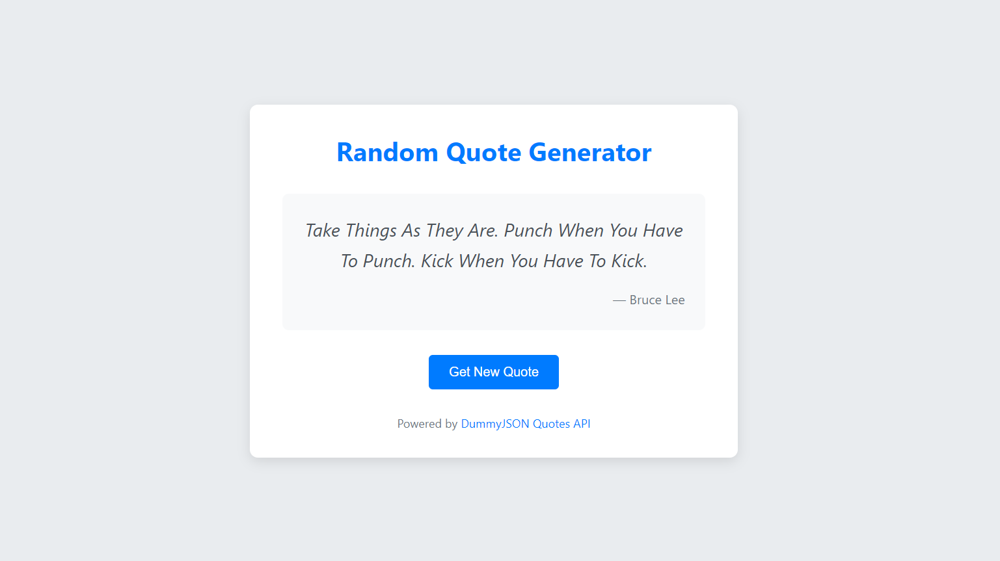

# Random Quote Generator

A simple web application that displays random quotes fetched from an external API. This project demonstrates the use of Vanilla JavaScript to make asynchronous API calls, parse JSON data, and dynamically update the DOM.

## Live Demo

[[Link to my live demo](https://zakkur17.github.io/random-quote-generator/)]

## Features

*   **Display Random Quotes:** Shows a random quote and its author.
*   **Fetch New Quotes:** A button to fetch and display a new random quote on demand.
*   **Loading State:** Indicates to the user when a new quote is being fetched.
*   **Error Handling:** Displays a user-friendly message if fetching a quote fails.
*   **Responsive Design:** Adapts to different screen sizes for a good user experience.

## Screenshot




## Technologies Used

*   **HTML5:** For the basic structure and content.
*   **CSS3:** For styling the application, including layout and visual presentation.
*   **Vanilla JavaScript (ES6+):** For the application logic, including:
    *   Asynchronous API calls using the `fetch` API and `async/await`.
    *   Parsing JSON data from the API response.
    *   Dynamic DOM manipulation to display quotes and authors.
    *   Event handling for the "New Quote" button.
    *   Basic error handling for API requests.
*   **External API:** [DummyJSON Quotes API](https://dummyjson.com/docs/quotes) (Initially intended to use Quotable API, but switched due to certificate issues with the original API at the time of development).

## Project Setup and Usage

1.  **Clone the repository (or download the files):**
    ```bash
    git clone https://github.com/Zakkur17/random-quote-generator.git
    ```
2.  **Navigate to the project directory:**
    ```bash
    cd random-quote-generator
    ```
3.  **Open `index.html` in your web browser.**
    No build steps or dependencies are required.

## Code Structure

*   `index.html`: The main HTML file for the application's structure.
*   `style.css`: Contains all CSS rules for styling.
*   `script.js`: Contains the JavaScript code for fetching and displaying quotes.

## Key Learning Points & Functionality Overview

*   **Asynchronous JavaScript:**
    *   Making API requests using `fetch()`.
    *   Handling Promises returned by `fetch()` using `async/await` syntax for cleaner asynchronous code.
    *   Understanding the request/response cycle.
*   **API Interaction:**
    *   Consuming data from a third-party REST API.
    *   Parsing the JSON response using `response.json()`.
*   **DOM Manipulation:**
    *   Selecting DOM elements using `document.getElementById()`.
    *   Dynamically updating the `textContent` of elements to display the fetched quote and author.
*   **Error Handling:**
    *   Using `try...catch` blocks to handle potential errors during API calls (e.g., network issues, server errors).
    *   Providing feedback to the user in case of an error.
*   **Event Handling:**
    *   Attaching an event listener to a button to trigger an action (fetching a new quote).

## Note on API Used

This project was initially planned to use the Quotable API (`https://api.quotable.io/random`). However, due to an SSL certificate issue (`net::ERR_CERT_DATE_INVALID`) with the Quotable API at the time of development, the project was adapted to use the [DummyJSON Quotes API](https://dummyjson.com/docs/quotes) (`http://dummyjson.com/quotes/random`) as a functional alternative. The core JavaScript logic for fetching and processing data remains illustrative of working with any similar JSON-based API.

## Future Enhancements (Optional)

*   Option to tweet or share the quote.
*   Displaying tags associated with the quote.
*   A more sophisticated loading indicator (e.g., a CSS spinner).
*   Caching quotes locally to reduce API calls or for offline use.

## Author

*   **Zakkur Lie-A-Ling**
*   GitHub: [@Zakkur17](https://github.com/Zakkur17)
*   LinkedIn: https://www.linkedin.com/in/zakkurliealing/

